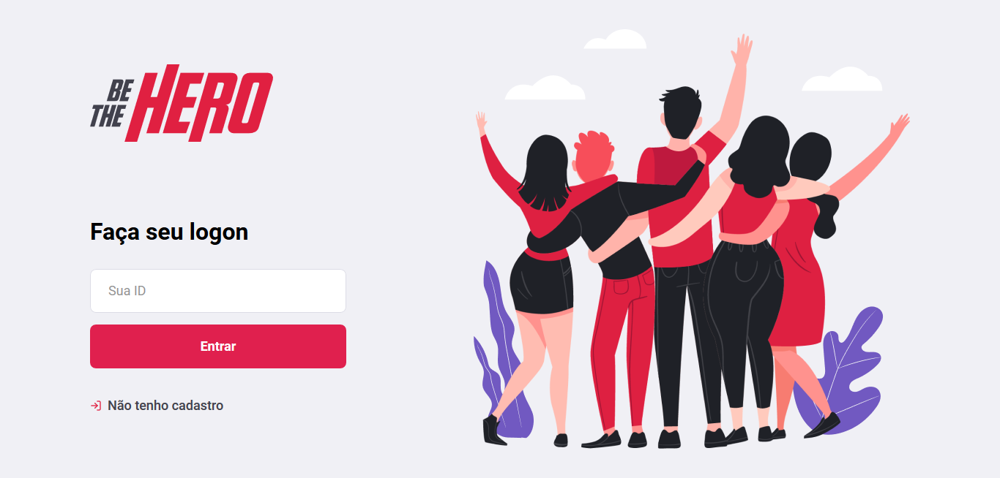

<p class="images" align=center>

</p>

# <p align="center">🚀 Semana OmniStack nº11 </p>

[Sobre o Projeto](#%f0%9f%93%9d-sobre-o-projeto) | [Minha Jornada](#%f0%9f%91%a3-minha-jornada) | [Tecnologias](#%f0%9f%92%bb-tecnologias-dessa-omnistack) | [Como usar](#%f0%9f%98%89-como-utilizar)

## 📝 [Sobre o Projeto](#sobre-o-projeto)



O projeto _Be The Hero_ tem o intuito de ajudar Ongs a cadastrar suas necessidades, angariar fundos e conectar pessoas que desejam ajudar nessas causas.

## 👣 [Minha Jornada](#%f0%9f%91%a3-minha-jornada)

Período: 23/03 a 27/03/2020

Aplicação: Be The Hero

- [X] 23/03 - Conhecendo a OmniStack
- [X] 24/03 - Criando a Base da Aplicação
- [X] 25/03 - Construindo a Interface Web
- [ ] ~~26/03 - Desenvolvendo o app mobile~~
- [X] 27/03 - Funcionalidades avançadas

**Considerações**: infelizmente não consegui realizar as atividades do dia 26/03, devido a problemas técnicos e outras situações. Contudo, estou muito feliz por ter participado! 😃

## 💻 [Tecnologias dessa OmniStack](#%f0%9f%92%bb-tecnologias-dessa-omnistack)

- Front-End
  - [ReactJS](https://reactjs.org)
- Back-End
  - Runtime JavaScript:
    - [NodeJS:](https://nodejs.org/)
      - [nodemonJS](https://nodemon.io/)
  - Banco de Dados:
    - [SQLite](https://www.sqlite.org)
    - [knexJS](http://knexjs.org/)
- Cliente API REST:
  - [Insomnia](https://insomnia.rest/)
- Validação de Dados:
  - [Biblioteca Celebrate](https://github.com/arb/celebrate)
- Testes:
  - Unitário: [Jest](https://jestjs.io/)
  - Integração: [SuperTest](https://github.com/visionmedia/supertest)


# 😉 [Como utilizar](#%f0%9f%98%89-como-utilizar)

Clonando esse repositório:

```bash
git clone https://github.com/vanribeiro/semana-omnistack-11.git
```

## Para ver o `Client-Side`(Front-End):

```bash
cd semana-omnistack-11/frontend
```

Instale as dependências:

```bash
npm install
```
Após completar o download, execute:

```bash
npm start
```

Para visualizar a aplicação no navegador, acesse:

```bash
http://localhost:3000/
```

## Para ver o `Server-Side`(Back-End):

```bash
cd semana-omnistack-11/backend
```

Instale as dependências:

```bash
npm install
```
Após completar o download, execute:

```bash
npm start
```

Para visualizar a aplicação no navegador, acesse:

```bash
http://localhost:3333/
```
